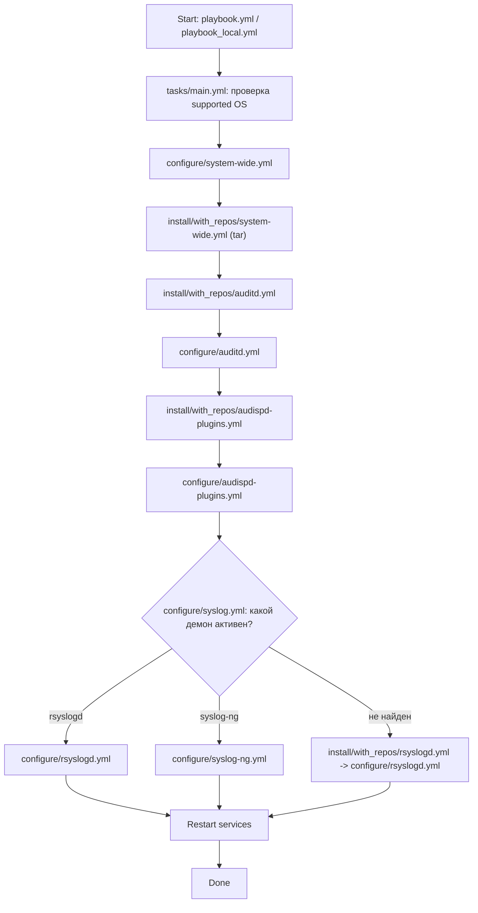

# Архитектура PT_LEP_unix

## 1. Назначение

Роль `PT_LEP_unix` подготавливает Linux-хост к интеграции с SIEM за счет:
- установки и настройки `auditd`;
- включения вывода audit-событий через `audispd-plugins` в `local6`;
- настройки syslog-демона (`rsyslog`/`syslog-ng`) для пересылки событий на SIEM-агент(ы).

## 2. Основные компоненты

- **Orchestration**:
  - [playbook.yml](../playbook.yml)
  - [playbook_local.yml](../playbook_local.yml)
- **Главный сценарий роли**:
  - [tasks/main.yml](../tasks/main.yml)
- **Конфигурация**:
  - [defaults/main.yml](../defaults/main.yml)
  - [vars/main.yml](../vars/main.yml)
  - [vars/siem_agents.yml](../vars/siem_agents.yml)
- **Настройка сервисов**:
  - [tasks/configure/auditd.yml](../tasks/configure/auditd.yml)
  - [tasks/configure/audispd-plugins.yml](../tasks/configure/audispd-plugins.yml)
  - [tasks/configure/rsyslogd.yml](../tasks/configure/rsyslogd.yml)
  - [tasks/configure/syslog-ng.yml](../tasks/configure/syslog-ng.yml)
  - [tasks/configure/syslog.yml](../tasks/configure/syslog.yml)
- **Установка ПО**:
  - `tasks/install/with_repos/*`
  - `tasks/install/without_repos/*`
- **Шаблоны конфигураций**:
  - [templates/auditd_00-siem.rules.j2](../templates/auditd_00-siem.rules.j2)
  - [templates/rsyslog_10-siem.conf.j2](../templates/rsyslog_10-siem.conf.j2)
  - [templates/syslog-ng_10-siem.conf.j2](../templates/syslog-ng_10-siem.conf.j2)

## 3. Поток выполнения

## 4. Канал доставки событий

1. `auditd` формирует события согласно `00-siem.rules`.
2. `audispd-plugins` направляет audit-события в facility `local6`.
3. Syslog-демон отправляет события на адреса SIEM-агентов, заданные в `facilities[facility]`.

## 5. Режимы установки

- **Основной режим**: установка из системных репозиториев (`apt`/`yum`/`apt_rpm`).
- **Fallback-режим**: при сбое установки из репозитория используется офлайн-репозиторий в `files/packages/<dist>/...` (если `upload_local_packages: true`).

## 6. Архитектурные ограничения

- Нет разделения на роль + коллекцию + CI pipeline.
- Нет автоматической валидации (`molecule`, `ansible-lint`, интеграционные тесты).
- Часть логики зависит от shell-команд и строковых сравнений версий.
